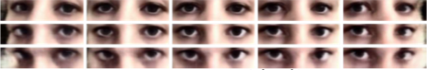

*Intelligent Robotics Seminar: Paper Review & Implementation, Universität Hamburg*

    

        <h4 class="text-[10px] font-bold uppercase tracking-[0.2em] text-main/40">Project Sources</h4>
        
Technical implementation and research paper review.

    

    

        
        
    

This project explores the implementation of **Few-Shot Adaptive Gaze Estimation (FAZE)**, a framework designed to bridge the gap between generic gaze estimation and highly personalized models. Traditional models often struggle with individual anatomical differences, whereas FAZE leverages meta-learning to adapt to new users using as few as 3 to 9 calibration samples.

The core of the system is the **Disentangling Transforming Encoder-Decoder (DT-ED)** network. This architecture is trained to decouple gaze direction, head pose, and facial appearance from raw images. By utilizing a latent space that represents these features independently, the model can synthesize novel viewpoints through a latent transformation, effectively augmenting the calibration data provided by the user.

A key contribution of this project is the application of **MAML (Model-Agnostic Meta-Learning)** to the gaze estimation task. By training the network to be highly adaptable, we achieve significant accuracy gains in "personalizing" the model to a specific individual's eyes and facial features. The results demonstrate that FAZE significantly outperforms static baseline models, providing a robust solution for hands-free interaction and user-intent detection in real-world scenarios.

***
