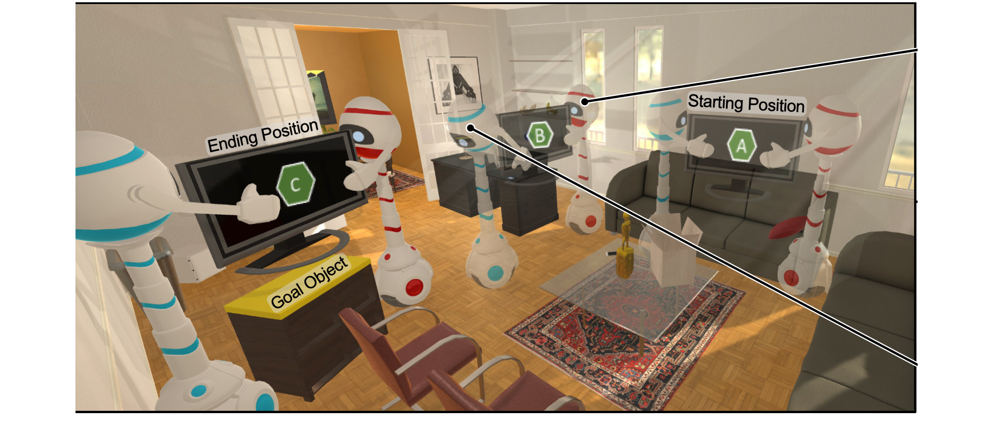

*CV Masters Seminar, Universität Hamburg*

    

        <h4 class="text-[10px] font-bold uppercase tracking-[0.2em] text-main/40">Project Sources</h4>
        
Technical implementation and research paper.

    

    

        
        
    

The project works around the recent advancements in object goal navigation using embodied AI agents. While CNN-based approaches have achieved state-of-the-art performance in these tasks, they are memory-intensive and have limitations in more complex environments. The emergence of Transformers has shifted the focus towards attention-inclusive, transformer-based approaches that leverage egocentric views and have scene understanding with multi-head attention.

The recent works that involve multiple agents working together, such as TBONE and Cordial Sync, and how they achieve SOTA performance. However, these approaches do not incorporate natural language processing (NLP) modules, which could improve the agents' understanding of the semantic meaning of the object.

This work aims to enable object recognition for multiple objects by incorporating Contrastive Language-Image Pre-Training (CLIP), a SOTA model that generates semantic embeddings using both image and textual features.

***