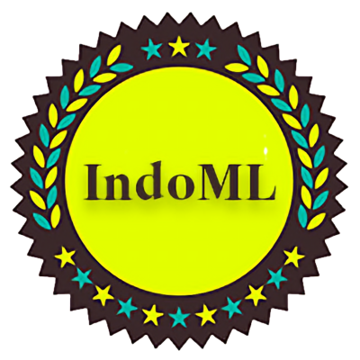

*Kaggle Competition and NLP Course Project, Universität Hamburg*

    

        <h4 class="text-[10px] font-bold uppercase tracking-[0.2em] text-main/40">Project Sources</h4>
        
Technical implementation and competition details.

    

    

        
        
    

The IndoRE project focused on relation extraction for three low-resource Indian languages: Bengali, Telugu, and Hindi. With relation extraction being a crucial task in natural language processing (NLP), the objective was to predict the relationship between a pair of entities given a sentence.

Due to the scarcity of tagged data for relation classification in Indian languages, the project aimed to explore and enhance this area by leveraging recent advancements in deep generative models. The challenge involved predicting relations from limited tagged training data, consisting of instances across 25 different relations for each language. Additionally, an untagged data dump was provided, which facilitated the use of techniques like similarity-based data augmentation or distant supervision to improve performance.

Employing mBERT and RoBERTa models, the project successfully tackled the relation extraction task. By leveraging these powerful models and exploring innovative techniques, the project pushed the boundaries of relation classification in low-resource Indian languages.

Overall, the IndoRE project served as an opportunity to showcase expertise in NLP, particularly in relation extraction for Bengali, Telugu, and Hindi. It demonstrated the ability to leverage limited tagged data and explore data augmentation and distant supervision techniques to improve model performance in the context of low-resource languages.

---